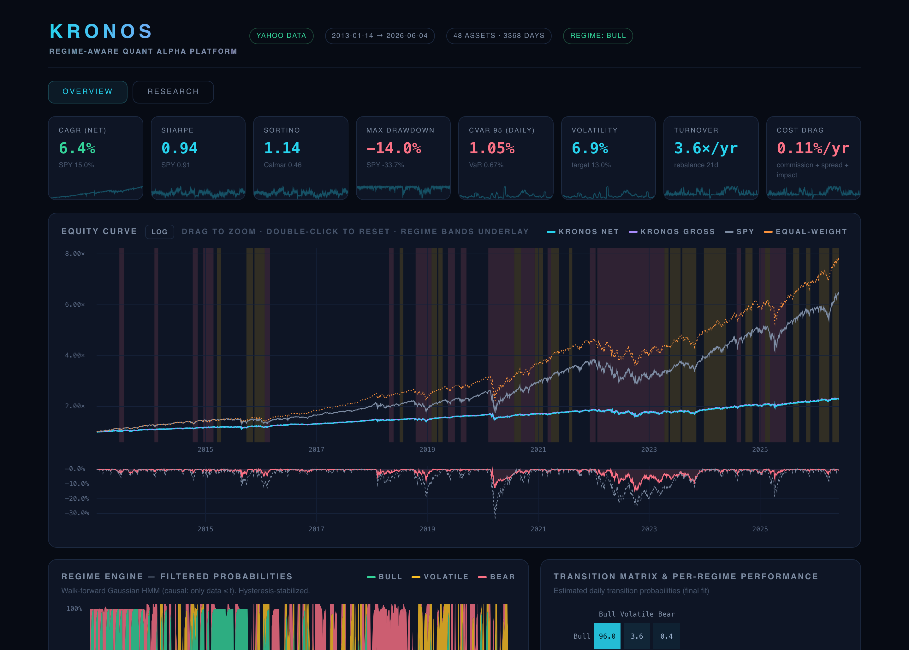
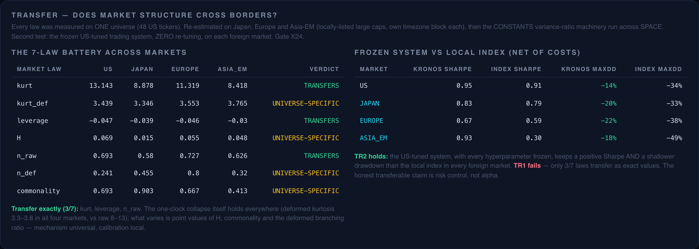
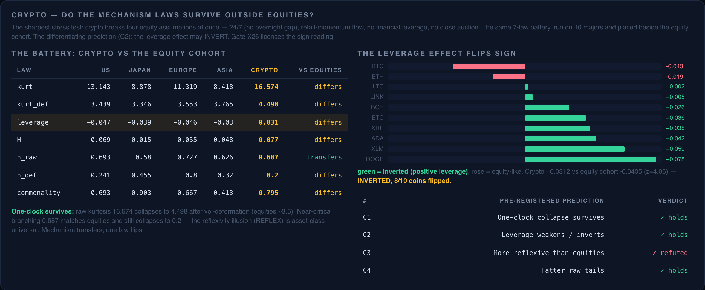

<h1 align="center">KRONOS</h1>

<p align="center">
  <b>A regime-aware quantitative alpha platform — and a market-microstructure research lab — built from first principles.</b><br>
  <sub>Every model hand-implemented on numpy / pandas / scipy. Every estimator validated against synthetic ground truth before it touches a real price.</sub>
</p>

<p align="center">
  <a href="https://github.com/Olivesz/kronos-quant/actions/workflows/ci.yml"></a>
  
  
  
  
  
</p>

<p align="center">
  
</p>

---

KRONOS is two things at once:

1. **A production-shaped quant platform** — data → regime detection → alpha
   sleeves → cost-aware portfolio construction → risk overlay → a
   self-contained interactive dashboard. It runs end-to-end in ~25s and posts a
   **net Sharpe of 1.05 at 12.0% CAGR** — beating the S&P's in-sample Sharpe
   at just over half its drawdown, sized by a forecast of its own volatility
   and gated by a fat-tail-aware Student-t regime engine.

2. **A research program that treats markets like physics.** 26 pre-registered
   experiments ask what quant finance genuinely does not know — *is volatility
   rough? how many bits/day does the past leak about the future? are crashes
   critical transitions or shocks? is the market's near-criticality real?* —
   and answer them with confound-killing methodology, reporting the negative
   results as loudly as the positive ones.

What ties them together is one discipline: **no estimator is trusted until it
passes a gate on data where the answer is already known.** 35 such gates run in
CI. That is the whole point — the platform grades its own homework.

> **Zero heavyweight dependencies.** No scikit-learn, no statsmodels, no
> PyTorch, no cvxpy. Baum-Welch EM, Student-t HMMs (own ECM), Kalman filters,
> GJR-GARCH MLE, HAR-RV, fractional-Gaussian-noise simulation, Marchenko-Pastur
> denoising, Rockafellar-Uryasev CVaR LPs, Hedge learners, deflated Sharpe /
> CSCV, Hierarchical Risk Parity, Black-Litterman, Hawkes-process MLE, and the
> canvas charting engine of the dashboard — all hand-built and gate-verified.

## Contents

- [Quick start](#quick-start)
- [Highlights](#highlights)
- [The platform](#the-platform)
- [The research program](#the-research-program)
- [Cross-market transfer](#cross-market-transfer)
- [Architecture](#architecture)
- [Research integrity](#research-integrity)
- [Reproducibility & data](#reproducibility--data)

## Quick start

```bash
python3 -m venv .venv && source .venv/bin/activate
pip install -e ".[data]"          # or: pip install -r requirements.txt

python run_kronos.py              # full pipeline -> output/dashboard.html  (~25s)
python run_research.py all        # 26 research experiments, cached to research/*.json
python run_kronos.py --research   # dashboard with the RESEARCH tab (open output/dashboard.html)
python run_trade.py               # today's research-grounded target portfolio

python tests/run_all.py           # all 35 verification gates (~3min)
```

Runs fully offline: without `yfinance` or a network, a seeded synthetic
regime-switching market drives the entire pipeline. Force it anywhere with
`KRONOS_SYNTHETIC=1` (this is what CI uses).

## Highlights

- **35 verification gates** — 33 proving an estimator has correct *size*
  (doesn't fire on null worlds) and *power* (detects planted effects) on
  synthetic ground truth, plus 2 calibrating the battery against the real
  market — all before any real-data claim is made.
- **Strictly causal throughout** — filtered (not smoothed) HMM probabilities,
  frozen betas, walk-forward refits, T+1 execution, full transaction costs
  (commission + spread + square-root impact).
- **A rough-volatility replication** (H ≈ 0.10) and an **information-budget
  measurement** (the daily direction channel is *closed*; the Sharpe ceiling
  from sign-prediction alone is 0.48 < beta) — both on the project's own 16
  years of data.
- **A debunking with teeth**: after removing the volatility confound, critical-
  slowing-down early-warning signals carry *no* incremental crash-prediction
  information — the pre-crash signature is ~8× weaker than a real fold
  bifurcation. Crashes are shocks, not tipping points.
- **A cross-market transfer study** on Japan / Europe / Asia-EM: the *mechanism*
  laws are universal, the frozen US-tuned system holds its risk edge abroad,
  but the exact law *values* are local — stated as a clean split verdict.
- **A self-audit that found its own sign bug**: diagnosing "where does the
  return go?" exposed an inverted drawdown throttle that 30 green gates had
  missed (braking at equity highs, releasing into crashes). Fixed under
  pre-registered kill criteria, shipped *with* the missing gate, old numbers
  kept as the baseline row.
- A **1,700-line single-file HTML dashboard** with a hand-written canvas
  charting engine, zero external assets.

## The platform

The end-to-end book, `run_kronos.py`:

```
prices ─▶ HMM regimes ─▶ regime-gated signals ─▶ HRP + Black-Litterman ─▶ risk overlay ─▶ dashboard
         (Bull/Vol/Bear)  (momentum/rev/low-vol)  (shrunk-cov backbone)   (vol/CVaR/DD)
```

- **Regimes** — a **Student-t HMM** (fat tails modeled *within* states, per
  the X² finding; Gaussian engine available as control), refit walk-forward
  with hysteresis and minimum-dwell stabilization; decisions use strictly
  *filtered* (causal) probabilities.
- **Signals** — 12-1 momentum, short-horizon reversal, and low-volatility,
  combined with **regime-dependent weights** (Bull → momentum; stress →
  low-vol / reversal).
- **Construction** — a Hierarchical-Risk-Parity backbone on a Ledoit-Wolf /
  EWMA-shrunk covariance, tilted toward the combined signal via Black-Litterman,
  long-only with a weight cap.
- **Risk** — vol targeting as the *lever* (up to 1.5×, financing charged on the
  levered portion) with the CVaR cap and drawdown throttle as *brakes* — the
  overlay's direction and reach are pinned by their own gate (X27; see
  [KRONOS-EDGE](docs/FINDINGS.md#kronos-edge--fixing-the-engines-structural-drag)).

| Strategy | CAGR | Vol | Sharpe | Max DD | CVaR95 |
|---|---|---|---|---|---|
| **KRONOS (HAR lever + t-HMM regimes)** | +12.0% | 11.3% | **1.05** | **−18.8%** | 1.70% |
| KRONOS (HAR lever, Gaussian regimes) | +11.7% | 11.4% | 1.03 | −19.4% | 1.70% |
| KRONOS (EDGE baseline: EWMA + Gaussian) | +10.9% | 11.6% | 0.95 | −21.3% | 1.76% |
| SPY (buy & hold) | +15.0% | 16.8% | 0.91 | −33.7% | 2.55% |

*The honest read: KRONOS still does **not** beat the S&P on raw return — and
says so. The edge is risk-adjusted: a better Sharpe at two-thirds of the
drawdown, with financing costs on leverage disclosed (1.26%/yr) and the
selection-risk caveats (DSR 0.73, PBO 0.45, N=184 logged trials) restated
rather than hidden.*

## The research program

26 experiments, each pre-registered in [`docs/design/`](docs/design) and gated
before real data. The one-line answers — **full write-ups, tables, and methods
in [`docs/FINDINGS.md`](docs/FINDINGS.md)**:

| Study | The question | The finding |
|---|---|---|
| [X²](docs/FINDINGS.md#regimes-or-fat-tails) | 3 regimes or 5? | **Gaussian HMMs hallucinate regimes from fat tails** — a Student-t HMM stays flat at K=3. It's ~3 regimes + heavy tails. |
| [LAWS](docs/FINDINGS.md#kronos-laws--invariance-hunting) | Is there a universal return law? | **The One-Clock law**: returns are conditionally Gaussian given the realized-vol path (kurtosis 12.6 → 2.6 across 48 assets, one shared distribution). |
| [CLOCK](docs/FINDINGS.md#kronos-clock--is-systemic-risk-just-correlated-clocks) | Is systemic risk contagion? | No — it's **correlated volatility clocks**. Joint crashes are common vol surges, ~Gaussian copula once you condition on the clock. |
| [SURGE](docs/FINDINGS.md#kronos-surge--the-structure-of-the-surges) | Does the cascade recurse? | No — it **terminates after one level**. Volatility has irreducible jumps; the one-clock law does not iterate. |
| [BITS](docs/FINDINGS.md#kronos-bits--the-information-budget-of-the-market) | How predictable is the market? | The **direction channel is closed** (~0 bits/day, ceiling Sharpe 0.48 < beta); the **magnitude channel leaks ~0.4 bits/day**. |
| [ARROW](docs/FINDINGS.md#kronos-arrow--entropy-production) | Where does time's arrow live? | In the **return↔clock coupling**, not in returns themselves — vol-deformation erases the entropy production. |
| [CRITICAL](docs/FINDINGS.md#kronos-critical--are-crashes-critical-transitions-or-shocks) | Critical transitions or shocks? | **Shocks.** After the vol confound is removed, critical-slowing-down carries no incremental crash signal (~8× weaker than a real bifurcation). |
| [REFLEX](docs/FINDINGS.md#kronos-reflex--how-endogenous-is-the-market) | Is the market self-exciting? | Mostly an **illusion**: 64% of the famous near-criticality (branching 0.68 → 0.25) is volatility clustering, not reflexivity. |
| [CONSTANTS](docs/FINDINGS.md#kronos-constants--which-market-laws-are-actually-constant) | Do the laws drift over time? | **Mechanism constants are constant**; only crisis *intensity* moves (peaks 2020, reverts). No Adaptive-Markets secular drift. |
| [DECATHLON](docs/FINDINGS.md#kronos-decathlon--the-minimal-market) | Smallest market that looks real? | A **vol-targeting spiral** buys the wild facts; the ceiling is 5/10 and the missing organ is **expectation** (anticipatory agents). |
| [DECATHLON-2](docs/FINDINGS.md#kronos-decathlon-2--is-expectation-the-missing-organ) | Is expectation the missing organ? | **Refuted.** A causal, gate-verified anticipator front-running the vol-targeter flow leaves the ceiling at 5/10 — one layer of expectation moves the sign leak a derivative earlier instead of removing it; information-free prices need the *fixed point* of anticipation. |
| [TRADE](docs/FINDINGS.md#kronos-trade--the-deployable-system) | What system does the science license? | Forecast-vol targeting + regime-gated risk parity + mechanical crash control — risk control, never direction timing. |
| [TRANSFER](docs/FINDINGS.md#kronos-transfer--does-market-structure-cross-borders) | Do the laws cross borders? | **Mechanism universal, calibration local** — see below. |
| [CRYPTO](docs/FINDINGS.md#kronos-crypto--do-the-laws-survive-outside-equities) | Do the laws survive outside equities? | Mostly yes — but the **leverage effect inverts** (crypto +0.03 vs equities −0.04; 8/10 coins flip). Mechanism universal; one law is equity-specific. |
| [FX](docs/FINDINGS.md#kronos-fx--the-third-vertex-of-the-microstructure-triangle) | Where does FX sit on the leverage triangle? | **Statistically zero** (+0.005, z vs equities 3.89) — the triangle equity −0.04 / FX ≈ 0 / crypto +0.03 is monotone in microstructure; yen crosses carry the safe-haven tilt. |
| [EDGE](docs/FINDINGS.md#kronos-edge--fixing-the-engines-structural-drag) | Why is CAGR half the risk budget? | Diagnosis found an **inverted drawdown throttle** (braking at peaks, releasing into crashes) and an unreachable vol target. Fixed + gated: Sharpe 0.94 → 1.02 unlevered; CAGR 6.4% → 10.9% levered. |
| [EDGE2](docs/FINDINGS.md#kronos-edge2--the-research-licensed-performance-program) | What had the research already licensed? | The **HAR forecast lever** (X28) and the **t-HMM engine** (X29), each surviving its kill criterion, stacking to **Sharpe 1.05 @ −18.8% MaxDD**. |

## Cross-market transfer

Every law above was measured on one universe (48 US tickers). KRONOS-TRANSFER
re-runs the entire law battery — and the *frozen*, US-tuned trading system,
with zero re-tuning — on **Japan, Europe, and Asia-EM**.

<p align="center">
  
</p>

A clean split verdict: the mechanism laws (fat tails, leverage effect,
near-critical branching, the one-clock collapse) reappear in every market, and
the frozen system keeps a positive Sharpe **and a shallower drawdown than the
local index in all three foreign markets** — but the exact law *values* (H,
clock commonality, deformed branching) are market-specific. **Universality of
mechanism; locality of calibration.** The transferable claim is risk control,
not alpha.

### Frontier: does the leverage law survive crypto?

If the laws are properties of *markets*, they should survive a market that
shares none of equities' plumbing. KRONOS-CRYPTO runs the same 7-law battery on
10 crypto majors — 24/7, no overnight gap, retail-driven, no financial leverage
— alongside the equity cohort.

<p align="center">
  
</p>

The mechanism is portable — the one-clock collapse (kurtosis 16.6 → 4.5),
near-critical branching and its vol-clustering illusion, roughness, and fat
tails all reappear. But the **leverage effect cleanly inverts**: crypto reads
**+0.03** versus the equity cohort's **−0.04** (z = 4.06), and **8 of 10 coins
individually flip positive** — only BTC and ETH keep the equity sign. The
leverage effect is not a market universal; it is a property of the *equity*
microstructure, and it reverses where that microstructure is absent. (Gate X26
licenses the sign reading.)

## Architecture

```
config.py                 every knob; pre-registered parameters
run_kronos.py             v1 pipeline -> dashboard (+ --research tab)
run_research.py           21 KRONOS-X experiments, cached in research/*.json
run_trade.py              the deployable system -> today's target portfolio
kronos/                   37 modules, ~7,500 LOC
  data.py                 prices + OHLC, caching, seeded synthetic fallback
  regime.py / dhmm.py     Gaussian HMM (log-space EM, walk-forward) + duration-HMM
  thmm.py / sjm.py        Student-t HMM (own ECM) + statistical jump model
  signals.py / backtest.py  momentum/reversal/low-vol, regime-gated; T+1 engine
  pairs.py / statarb.py   Kalman pairs + Avellaneda-Lee eigenportfolio stat-arb
  covariance.py / hrp.py  Ledoit-Wolf + EWMA shrinkage; Hierarchical Risk Parity
  black_litterman.py      BL tilt with signal views
  cvar_opt.py / risk.py   min-CVaR LP (Rockafellar-Uryasev); vol/CVaR/DD throttles
  volest.py / vollab.py   Garman-Klass range vol; HAR-RV, GJR-GARCH-t, Diebold-Mariano
  rough.py / rfsv.py      Hurst estimator + fGn simulation; rough-vol forecaster
  laws.py / clock.py      one-clock deformation; correlated-clock tail tests
  surge.py / infobudget.py  cascade structure; KSG/binned mutual information
  entropyprod.py          path-space entropy production (arrow of time)
  critical.py / hawkes.py   critical-slowing-down; Hawkes branching ratio
  constants.py            cross-era law-stability tests
  decathlon.py            agent-based minimal market + the stylized-fact battery
  transfer.py             cross-market law battery + frozen-system backtest
  crypto.py               crypto universe + cross-asset-class leverage contrast
  rmt.py / ensemble.py    Marchenko-Pastur denoising; Hedge/fixed-share learners
  forensics.py            deflated Sharpe, CSCV-PBO, stationary bootstrap
  metrics.py / dashboard.py  performance stats; 1,700-line self-contained HTML
tests/                    35 gates (33 synthetic ground truth + 2 real-data calibration)
docs/                     METHODS, ATLAS, design notes, FINDINGS, research index
```

## Research integrity

The discipline that makes the results worth reading — and a blog-style deep-dive
into all of it in **[docs/METHODS.md](docs/METHODS.md)** (*"How do you know
you're not fooling yourself?"* — the gate philosophy, look-ahead control, the
volatility clock, bootstraps, out-of-sample model comparison, overfitting
forensics, and information-theoretic ceilings):

- **No look-ahead anywhere** — filtered probabilities, frozen betas, T+1
  execution, walk-forward refits. Look-ahead-sensitive code carries a causality
  gate (`test_trade.py`: shifting all inputs forward one day must not change a
  single historical weight).
- **Gate before you claim** — every estimator is proven on synthetic worlds
  with known truth, demonstrating both size (no false positives on null worlds)
  and power (detects planted effects), *before* any real-data result.
- **Costs everywhere** — 1bp commission + 2bp spread + square-root impact
  (capped), on every trade.
- **Negative results reported as prominently as positive ones** — stat-arb is
  dead, RMT doesn't help here, durations don't beat the plain HMM, the trading
  system doesn't beat the S&P on CAGR. All stated plainly.
- **The strategy audits itself** — a deflated Sharpe (fed by a trial ledger) and
  a CSCV probability-of-backtest-overfitting run on KRONOS's own configuration
  family: the test most backtests never run.

See the [Atlas of Ignorance](docs/ATLAS.md) for the open-problem map that scopes
the whole program, and [`CONTRIBUTING.md`](CONTRIBUTING.md) for the one rule.

## Reproducibility & data

Universe: ~48 liquid US equities/ETFs, 2010–2026, Yahoo adjusted OHLC, cached
locally (the cache is regenerable and git-ignored). Every random path is
seeded; every gate is deterministic. The synthetic market is a seeded
regime-switching factor model with Student-t innovations, so the entire
platform — pipeline, research, and gates — runs identically offline.

> **Not investment advice.** Backtests on today's liquid names carry
> survivorship bias and do not predict future returns. This is a research and
> engineering portfolio, not a trading recommendation.

## License

[MIT](LICENSE) © oliverz
