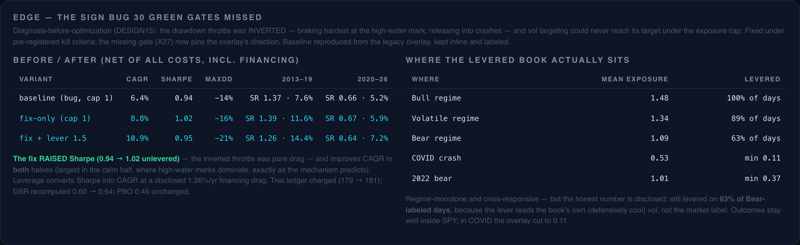

# KRONOS — Research Findings

The full write-ups behind every experiment. Each was pre-registered in
[`docs/design/`](design/) and validated on synthetic ground truth (a numbered
`GATE X*`) before touching real data. For the map of which module and gate
backs each study, see [the research index](README.md). Results are on ~48
liquid US equities/ETFs, 2010–2026, Yahoo adjusted OHLC.

- [KRONOS-X — the six pre-registered questions](#kronos-x--the-six-pre-registered-questions)
- [KRONOS-X² — regimes or fat tails?](#regimes-or-fat-tails)
- [KRONOS-LAWS — invariance hunting](#kronos-laws--invariance-hunting)
- [KRONOS-CLOCK — is systemic risk just correlated clocks?](#kronos-clock--is-systemic-risk-just-correlated-clocks)
- [KRONOS-SURGE — the structure of the surges](#kronos-surge--the-structure-of-the-surges)
- [KRONOS-BITS — the information budget of the market](#kronos-bits--the-information-budget-of-the-market)
- [KRONOS-ARROW — entropy production](#kronos-arrow--entropy-production)
- [KRONOS-CRITICAL — are crashes critical transitions or shocks?](#kronos-critical--are-crashes-critical-transitions-or-shocks)
- [KRONOS-REFLEX — how endogenous is the market?](#kronos-reflex--how-endogenous-is-the-market)
- [KRONOS-CONSTANTS — which market laws are actually constant?](#kronos-constants--which-market-laws-are-actually-constant)
- [KRONOS-DECATHLON — the minimal market](#kronos-decathlon--the-minimal-market)
- [KRONOS-TRADE — the deployable system](#kronos-trade--the-deployable-system)
- [KRONOS-TRANSFER — does market structure cross borders?](#kronos-transfer--does-market-structure-cross-borders)
- [KRONOS-CRYPTO — do the laws survive outside equities?](#kronos-crypto--do-the-laws-survive-outside-equities)
- [KRONOS-EDGE — fixing the engine's structural drag](#kronos-edge--fixing-the-engines-structural-drag)

---

## KRONOS-X — the six pre-registered questions

| Q | Question | Answer |
|---|----------|--------|
| Q1 | Does the market have more than 3 regimes? | **Mixed.** HMM predictive log-score rises through K=5, but the jump model peaks at K=3 — extra HMM states buy distributional flexibility (fat tails), not new economic regimes. |
| Q2 | Do explicit (semi-Markov) durations beat the HMM? | **No.** Duration-HMM ties plain HMM out of sample (3.1669 vs 3.1689 nats/day) — an honest negative; the test provably had power on synthetic semi-Markov worlds. |
| Q3a | Can we beat EWMA vol forecasts? | **Yes — HAR-RV**, decisively: QLIKE 0.417 vs 0.511, Diebold-Mariano −7.1 (p<0.001). GJR-GARCH ties HAR. |
| Q3b | Is volatility rough? | **Yes: H ≈ 0.10** (CI [0.08, 0.13]) on SPY Garman-Klass log-vol — replicating Gatheral-Jaisson-Rosenbaum on our own 16 years; stable across subwindows; cross-sectional median 0.07. |
| Q4 | Does online learning beat hand-made regime gates? | **All tie (Sharpe ≈ 0.99).** The sleeves are too correlated through the shared HRP backbone for blend weights to matter — the backbone does the work. |
| Q5a | Does RMT denoising beat Ledoit-Wolf? | **No** on this universe (LW 5.84% vs RMT 6.04% realized min-var vol): with N=48, T=252 the noise is mild; RMT is built for far wider universes. |
| Q5b | Does a min-CVaR LP beat HRP? | **Marginally yes**: it delivers what it optimizes (realized CVaR 1.24% vs 1.34%) at comparable Sharpe (1.07 vs 1.03). |
| Q6 | Is the strategy statistically real? | **Returns yes, selection no.** Bootstrap Sharpe CI [0.47, 1.45] excludes zero, but DSR = 0.60 after N=179 trials and PBO = 0.45: the edge over sibling configurations is not certifiable — the test most backtests never run, run on ourselves. *(Recomputed after [EDGE](#kronos-edge--fixing-the-engines-structural-drag): DSR 0.64, N=181, PBO unchanged.)* |
| — | Does classic stat-arb still work? | **No — alpha decayed.** Avellaneda-Lee eigenportfolio stat-arb: −1.3%/yr (SR −0.24) despite the implementation extracting planted OU residuals at Sharpe 2.4 in its gate. Replicates the documented post-2008 decay. |

**Synthesis:** the regime-gated HRP core (Sharpe 0.95, maxDD −14% at the time
of this study — pre-[EDGE](#kronos-edge--fixing-the-engines-structural-drag))
beats both stat-arb overlays; vs SPY it matches Sharpe at half the drawdown.
The science's biggest wins: HAR-RV for vol, the rough-vol replication, and the
forensic honesty about what is and isn't certifiable.

## KRONOS-X² — regimes or fat tails?

The headline result of the project. Q1's "mixed" answer is resolved by a
control experiment: a **Student-t HMM** (own ECM: latent gamma scale weights
inside forward-backward, per-state ν via the digamma equation) that models fat
tails *within* states.

| Study | Result |
|---|---|
| **K-hallucination Monte Carlo** (true K=3 worlds) | On the fat-tailed world, Gaussian-HMM model selection chooses K>3 in **88%** of seeds (6/8 pick K=5); the t-HMM overfits only 38% (vs a 50% base rate on Gaussian worlds for both). **Gaussian HMMs hallucinate regimes from fat tails.** |
| **Real data (walk-forward, eval 2019+)** | The Gaussian K-curve rises (3.169→3.189, K=3→5) exactly like the fat-world MC; the **t-HMM curve is flat at K=3** (T5 vs T3: AG +0.04, p=0.97). A two-state t-HMM (3.1895) matches the five-state Gaussian (3.1888). **Verdict: ~3 regimes + fat tails, not 5 regimes.** |
| **Market tail structure** (t-HMM K=3, per-state ν) | Bull ν≈17 (mildly fat), **Volatile ν≈3.7 (extremely heavy)**, Bear ν≈300 (≈Gaussian). The volatile regime carries the tail surprises; crash regimes are "predictably bad". |
| **Formal inference** | Amisano-Giacomini: t-HMM-3 beats SJM-3 (p=0.011), beats Gaussian-3 and DurHMM marginally (p≈0.06); Hansen-Lunde-Nason **Model Confidence Set** (α=10%) eliminates SJM-3, best member T5 (statistically tied with T3). |
| **Does roughness forecast?** (RFSV kernel forecaster) | RFSV crushes EWMA (AG +5.5), ties GARCH, **survives the vol-model MCS** — but HAR wins the pairwise test (AG −2.3, p=0.022). Roughness forecasts competitively at daily horizons; it doesn't dethrone HAR. |

New machinery, all gated on synthetic ground truth first: Student-t HMM ECM
(Gate X11: ν recovery ±0.6), Amisano-Giacomini tests (Gate X12: 4.5% empirical
size), Model Confidence Set (88% coverage / 88% power), RFSV fractional-kernel
forecaster (Gate X13).

## KRONOS-LAWS — invariance hunting

Strategy shift: hunt laws, not alphas. Three killable screens, two survived:

| Screen | Verdict |
|---|---|
| **L1 — One-Clock Hypothesis** (returns are conditionally Gaussian given the realized-vol path) | **Survived spectacularly.** Median kurtosis across 48 assets: 12.6 → **2.60**; fitted ν: 3.3 → ~200; cross-asset KS distance only **1.10× the sampling floor** — after deformation, equities, bonds, gold, and credit share one distribution. |
| **P1b — the causal closure of the X² paper** | On deformed returns the Gaussian K-rise(3→5) goes **+0.0199 → −0.0042** and all t-HMM ν → Gaussian. The hallucinated regimes die with the tails: mechanism → cause → cure, one arc. |
| **L2 — parameter-free kurtosis law** (kurt = 3e^{4·Var(log σ)}) | **Killed, informatively**: log-corr 0.27, median excess +7.1 — most unconditional kurtosis is day-specific (jumps/gaps), not slow SV. |
| **L3 — multifractal universality** | **Survived the pre-registered bar**: intermittency λ² median 0.079, IQR [0.063, 0.091] across all assets — with the known tail-confound caveat (see CLOCK). |

Gate X14 first proved the machinery on simulated SV worlds and identified the
noise-injection trap (standardizing by an unsmoothed proxy *adds* tails) before
real data.

## KRONOS-CLOCK — is systemic risk just correlated clocks?

Raw returns crash *together* far more than any Gaussian copula allows.
Contagion — or just correlated volatility clocks? All 1,128 pairs tested
against finite-sample Gaussian-copula nulls (rank-calibrated), under two
deformations. Gate X15 proved the test can both exonerate (correlated clocks,
no jumps → 0% false convictions) and convict (joint-jump world → 87%
detection).

| Version | pairs above null 95% (q=5%) | median excess λ |
|---|---|---|
| raw returns | **93%** (equities 97%) | +0.109 |
| ÷ same-day clock | **15%** | +0.012 |
| ÷ lagged clock | **71%** | +0.058 |

**Verdict: systemic tail risk IS correlated clocks — but the clocks themselves
crash together unpredictably.** Conditional on the realized vol paths,
cross-asset dependence is ~Gaussian copula (clocks explain ~89% of the
joint-tail excess). Relative to yesterday's information, 71% of pairs still
exceed the null: joint crashes are common *volatility surges* no single-asset
model can forecast. Along the way: the "universal multifractality" (L3) was
**entirely the clock** — λ² goes 0.079 → −0.006 after deformation.

## KRONOS-SURGE — the structure of the surges

CLOCK's irreducible object — the common, unpredictable clock surge —
interrogated directly (gate X16 caught en route that *trailing* smoothing
mechanically manufactures a false arrow of time):

| Screen | Verdict |
|---|---|
| **S1 — does the clock have a clock?** | Yes, it clusters (AC₁\|u\| = +0.15, kurt 3.9) — **but the one-clock law does NOT recurse**: meta-deformation fails to gaussianize clock innovations (kurt 4.25 after). Returns are conditionally Gaussian given vol; vol is *not* conditionally Gaussian given vol-of-vol. The cascade terminates after one level — volatility has irreducible jumps. |
| **S2 — the arrow of time (Zumbach)** | **Faint in daily bars**: median Z +0.11, 4% of assets individually significant. The leverage class structure is textbook: SPY L(1–10) = −0.121, GLD ≈ 0, TLT = +0.030 — equities leverage, safe havens inverse. |
| **S3 — surge intensity forecastable?** | Joint-tail days are **2.1× more frequent** after high meta-clock terciles (3.2% → 6.8%) — but the block-bootstrap CI [0.97, 6.74] *narrowly includes 1*. Reported as suggestive, not significant. |

## KRONOS-BITS — the information budget of the market

How many bits/day does the past leak about the future, and what Sharpe could
ANY strategy achieve? (Kelly: the maximum log-growth edge equals the mutual
information.) Estimators gated against closed-form Gaussian/AR truth (X17).

| Channel | bits/day | meaning |
|---|---|---|
| direction, h=1 (SPY) | **0.0007** (not significant; 6/48 assets pass) | the daily sign channel is **closed** |
| direction, h=21 | 0.016 (significant) | slow trend/regime information exists at monthly horizon |
| **magnitude (vol), SPY** | **0.397** (era-stable) | the market broadcasts how big tomorrow will be, ~600× louder than which way |
| total next-day return | 0.199 | almost entirely magnitude information |

The **direction-only Sharpe ceiling is 0.48** — below buy-and-hold beta; even a
perfect daily sign-reader of our feature set loses to the index. KRONOS's edge
is slow tilts plus vol-targeting (the magnitude channel), not timing. Direction
bits that existed pre-2018 (0.009) are **zero post-2018** — the sign channel
closed within our own sample.

## KRONOS-ARROW — entropy production

The general irreversibility measure EP = KL(forward paths ‖ reversed paths), of
which SURGE's Zumbach statistic was a weak projection. Estimator calibrated on a
cyclic Markov chain with closed-form EP (2.04 measured vs 2.10 true bits); gate
X18.

| Series | assets with an arrow | median net EP |
|---|---|---|
| raw returns | **14/48** (SPY: 0.019 bits) | 0.0005 |
| vol clock (weekly innovations) | **11/48** | 0.0030 |
| deformed returns | 6/48 (≈ false-positive rate) | **0.0000** |

**Verdict: the arrow of time lives in the return↔clock coupling and the clock's
own fast-up/slow-down asymmetry — vol-deformation erases it.**

## KRONOS-CRITICAL — are crashes critical transitions or shocks?

The project's most paper-shaped result, on the contested Sornette/Scheffer
question. Naive financial early-warning studies are circular ("variance rises
before a vol spike" is trivially true). The non-circular question: does the
**critical-slowing-down signature** (restoring force φ→1) predict crashes
*beyond the contemporaneous volatility level*?

**Method (the contribution as much as the result):** crash onset = forward
20-day return below a causal 5% quantile (price-based, not vol-defined);
**incremental walk-forward AUC** of {vol + CSD} over {vol}, embargoed with
purged CV; stationary- and cluster-bootstrap CIs; and a **synthetic fold/shock
gate (X20)** proving the pipeline both convicts (fold bifurcation: +0.63) and
exonerates (shock process: +0.03, CI includes 0).

**Result — shock-dominated, with a vestigial tipping signature:** median
incremental AUC across 48 assets ≈ **0** (−0.0018); only 48% of assets positive
(sign-test p = 0.67). **True null, not low power**, proven two ways: the
benchmark itself predicts crashes, and the measured pre-crash φ precursor is
**+0.10 std — ~8× weaker than the fold bifurcation's +0.84 std**.

**Conclusion: market crashes are statistically closer to shocks than to
critical transitions** — a rigorous debunking of EWS-in-markets, with a
confound-killing methodology the contested literature lacks.

## KRONOS-REFLEX — how endogenous is the market?

The **Hawkes branching ratio** n — the fraction of extreme events that are
aftershocks of other events — decomposed by **volatility deformation**.

- **Raw** extreme-return events give median **n = 0.68** [0.61, 0.73] across 48
  assets — near-critical, **replicating Filimonov–Sornette**.
- **Vol-clock-deformed** events collapse to **n = 0.25** [0.20, 0.30] — sitting
  *at* a no-self-excitation null. **64% of the market's famous near-criticality
  is volatility clustering, not reflexivity.**
- Genuine day-scale jump-cascade reflexivity is statistically **absent**, did
  **not** rise post-2018 (opposite to the "vol-targeting-grew-reflexivity"
  hypothesis), and is **no higher for systemic than idiosyncratic** events.

Gate X21 anchors it: a pure stochastic-vol world with *zero* self-excitation
registers raw n = 0.74 that deformation reveals as 0.15. **At the daily horizon,
the market's apparent self-organized criticality is a volatility-clustering
illusion.**

## KRONOS-CONSTANTS — which market laws are actually constant?

The *Adaptive Markets* question. Each law is estimated across 5 era-windows and
classified by a variance-ratio + bootstrapped-trend test (gate X22: 8%
false-drift rate, 100% real-drift detection).

| Law | Verdict | Across eras |
|---|---|---|
| Leverage effect | **CONSTANT** | ~−0.05 every era |
| Branching ratio (raw) | **CONSTANT** | ~0.65 every era |
| Branching ratio (deformed) | **CONSTANT** | noisy but no trend |
| Roughness H | regime-varying | ~0.06, spikes to 0.12 in 2020 |
| One-clock kurtosis | regime-varying | always in [3.2, 3.7] — the law *always* holds |
| Clock commonality | regime-varying | peaks 0.81 in 2020, falls to 0.53 — crisis-driven |
| Fat-tail kurtosis | drifting | 5.6→12.2 (COVID-step), the only secular mover |

**Verdict: the market's *mechanism* constants are constant** — the leverage
effect, self-excitation ratio, and one-clock collapse hold in every era. What
varies is crisis *intensity*, peaking in 2020 and reverting. Clock commonality
even *fell* after 2020, refuting the ETF-ization hypothesis. **No support for
the Adaptive-Markets view of secularly-evolving structure.**

## KRONOS-DECATHLON — the minimal market

What is the smallest mechanism that scores like a real market? Ten events
distilled from our findings — calibrated so **real SPY scores 10/10 and GBM
exactly 3/10** (gate X19). A minimal flow-based agent market (fundamentalists,
chartists, vol-targeters, market makers, multi-horizon cohorts) ablated
ingredient by ingredient:

| Config | Score | What it buys |
|---|---|---|
| G / F (noise, fundamentals) | 3/10 | the Gaussian events come free |
| FC (+ chartists) | **1/10** | chartists alone are toxic — momentum leak destroys even efficiency |
| FV (+ **vol-targeters**) | 5/10 | **the star hypothesis**: the de-leveraging spiral buys the wild one-sided facts — fat tails, leverage, clock up-jumps, crash asymmetry |
| FCVM (+ market makers) | 5/10 | efficiency and wildness come from *different agents* |
| FCVMH (+ multi-horizon) | 4/10 | heterogeneity fails both ways — **D4 refuted** |

**The ceiling is 5/10, and the five missing events are diagnostic:** no flow
configuration buys long memory, the arrow-in-the-coupling, or information-free
signs. **The minimal market's missing organ is expectation** — anticipatory
agents who trade against predictable flows. The sharpest mechanism statement
the project produced about what makes real markets real.

## KRONOS-TRADE — the deployable system

`run_trade.py` turns the findings into trading software. The design is dictated
by the research, not by hope:

- **No daily direction timing** (BITS: that channel is closed). The alpha comes
  only from the **forecastable** channel.
- **HAR volatility forecasting drives position sizing** — *forecast*-vol
  targeting (size ahead of vol) rather than reacting to trailing realized vol.
- **Regime-gated risk-parity core** (HMM-3 filtered → shrunk-cov HRP →
  Black-Litterman tilt), the best-Sharpe configuration from the research.
- **Mechanical crash control** (drawdown throttle + CVaR cap), because CRITICAL
  proved crashes are unforecastable — you can't predict them, only de-risk.

**Walk-forward backtest (net of costs), 2013–2026** (post-DESIGN15 throttle
fix; no leverage, per this system's own pre-registration):

| Strategy | CAGR | Sharpe | MaxDD | CVaR95 |
|---|---|---|---|---|
| **KRONOS-TRADE (forecast-vol)** | 9.3% | **1.05** | **−16.5%** | 1.31% |
| Realized-vol control | 9.0% | 1.01 | −16.7% | 1.34% |
| SPY (buy & hold) | 15.0% | 0.91 | −33.7% | 2.55% |
| Equal-weight | 16.6% | 1.10 | −30.5% | 2.24% |

**Verdict (honest, as the research demands):** forecast-vol targeting beats the
realized-vol control (the magnitude channel *is* the edge); the system matches
SPY's risk-adjusted return at **less than half the drawdown**; and it **does
not** beat SPY on CAGR — stated plainly. Gate-verified causal (X23: exact
truncation-invariance), and it ships a live `recommend()` for today's weights.

## KRONOS-TRANSFER — does market structure cross borders?

Every law above was measured on ONE universe: 48 US tickers. If those laws are
properties of *markets*, they must reappear — with the same values — in markets
that share none of our tickers, currencies, or trading hours. Two pillars, both
pure reuse of validated machinery on three foreign universes (Japan, Europe,
Asia-EM; locally-listed large caps, one timezone block each). Gate X24 proves
the transfer test exonerates identical mechanisms and convicts different ones.

**Pillar 1 — the 7-law battery across space** (CONSTANTS machinery, but
cross-*universe* instead of cross-era):

| Law | US | Japan | Europe | Asia-EM | Verdict |
|---|---|---|---|---|---|
| fat tails (kurt) | 13.1 | 8.9 | 11.3 | 8.4 | **TRANSFERS** |
| one-clock kurtosis | 3.44 | 3.35 | 3.55 | 3.77 | universe-specific* |
| leverage effect | −0.047 | −0.039 | −0.046 | −0.030 | **TRANSFERS** |
| roughness H | 0.069 | 0.015 | 0.055 | 0.048 | universe-specific |
| branching (raw) | 0.69 | 0.58 | 0.73 | 0.63 | **TRANSFERS** |
| branching (deformed) | 0.24 | 0.46 | 0.80 | 0.32 | universe-specific |
| clock commonality | 0.69 | 0.90 | 0.67 | 0.41 | universe-specific |

\*the deformed kurtosis sits in **[3.3, 3.8] in all four markets** — the
one-clock *collapse* holds everywhere; only its exact value is
market-dependent.

**Pillar 2 — the frozen system**, US-tuned, zero re-tuning, on each foreign
market:

| Market | KRONOS Sharpe | index Sharpe | KRONOS MaxDD | index MaxDD |
|---|---|---|---|---|
| US | 0.95 | 0.91 | **−14%** | −34% |
| Japan | 0.83 | 0.79 | **−20%** | −33% |
| Europe | 0.67 | 0.59 | **−22%** | −38% |
| Asia-EM | 0.93 | 0.30 | **−18%** | −49% |

**Verdict — a clean split.** **TR1 fails** (only 3/7 laws transfer as exact
point values). **TR2 holds everywhere**: the frozen system keeps a positive
Sharpe *and* a shallower drawdown than the local index in every foreign market.
Mechanism is universal (fat tails, leverage, near-criticality, the one-clock
collapse all reappear); calibration is local (H, commonality, deformed
branching differ). The honest transferable claim is **risk control, not
alpha** — and it survives contact with markets it was never tuned on.

## KRONOS-CRYPTO — do the laws survive outside equities?

TRANSFER showed the laws reappear across equity markets that all share one
microstructure. Crypto breaks four equity assumptions at once — 24/7 (no
overnight gap), retail-momentum flow, no financial leverage, no close auction —
so it is the sharpest test of whether the laws are properties of *markets* or of
the *equity* microstructure. The same 7-law battery, run on 10 majors (BTC, ETH,
XRP, LTC, BCH, ADA, DOGE, LINK, XLM, ETC; Yahoo daily OHLC 2017–2026, 100% of
days with a real intraday range so Garman-Klass is valid), placed beside the
four equity universes from TRANSFER.

| Law | equity cohort | **crypto** | vs equities |
|---|---|---|---|
| fat tails (kurt) | 8.4 – 13.1 | **16.6** | differs (fatter) |
| one-clock kurtosis | 3.3 – 3.8 | **4.5** | differs (but still collapsed) |
| **leverage effect** | **−0.03 to −0.05** | **+0.031** | **differs — SIGN FLIPS** |
| roughness H | 0.015 – 0.069 | 0.077 | differs (mildly) |
| branching (raw) | 0.58 – 0.73 | 0.687 | **transfers** |
| branching (deformed) | 0.24 – 0.80 | 0.20 | differs |
| clock commonality | 0.41 – 0.90 | 0.795 | differs (high, as expected) |

**The pre-registered scorecard:**

- **C1 — the One-Clock law survives. ✓** Raw kurtosis 16.6 collapses to a
  deformed 4.5 after vol-standardization. The *collapse* is universal — crypto
  returns are conditionally ~Gaussian given their own vol path, just like
  equities/bonds/gold — even though the floor (4.5) sits a little above the
  equity ~3.5.
- **C2 — the leverage effect INVERTS. ✓ (the headline)** Crypto's leverage
  effect is **+0.031**, *positive*, versus the equity cohort's **−0.041**
  (z = 4.06). **8 of the 10 coins individually flip to positive** — only BTC
  (−0.043) and ETH (−0.019) keep the equity-style negative sign; the
  retail/meme end (DOGE +0.078, XLM +0.059, ADA +0.042) is most inverted. A law
  that held across every equity market, bonds, and gold **reverses sign** under
  crypto's microstructure. Mechanistically consistent: no financial leverage,
  no institutional de-risking cascade, and a retail FOMO dynamic where *rallies*
  (not crashes) spike volatility.
- **C3 — more reflexive? ✗ refuted.** Raw branching 0.687 ≈ the equity median
  0.659 (not significant) — crypto is **not** meaningfully more self-exciting.
  And it *still* collapses to 0.20 after vol-deformation, so REFLEX's finding
  (the market's apparent near-criticality is mostly a volatility-clustering
  illusion) is **asset-class-universal** too.
- **C4 — fatter raw tails. ✓** Kurtosis 16.6 vs the equity median 10.1.

**Verdict.** The mechanism is remarkably portable — the one-clock collapse,
near-critical branching and its vol-clustering illusion, roughness, and fat
tails all reappear in a market that shares none of equities' plumbing. But the
**leverage effect is not a market universal at all; it is a property of the
equity microstructure**, and it cleanly inverts where that microstructure is
absent. Gate X26 licenses the sign reading: on synthetic worlds with a known
leverage sign (equity-negative, inverted-positive, symmetric-zero), the
estimator recovers each with wide separation, so the crypto inversion is a real
property of the data, not an artifact.

## KRONOS-EDGE — fixing the engine's structural drag

The flagship book posted Sharpe 0.94 at only 6.9% realized vol against a 13%
target — good risk-adjusted, weak CAGR. Rather than tune parameters at the
result, we diagnosed **where the return goes** ([DESIGN15](design/DESIGN15.md),
pre-registered with expectations and kill criteria before the repaired system
was run).

  

**The diagnosis:**

- The underlying signal book is strong: **Sharpe 1.04 at 10.45% vol** at
  exposure 1. The overlay, not the alpha, was the drag.
- **The drawdown throttle had an inverted sign** — a genuine bug, duplicated in
  both `risk.py` and `trade.py`. `m_dd = 1 + (dd - dd_start)(1-floor)/span`
  with a negative `span` yields **0.50 at the high-water mark** (maximum
  braking at the peak) and **1.0 at −20% drawdown** (brake fully released in a
  crash) — the intended crash insurance, exactly reversed, with the wrong side
  hidden by a `clip(…, 1.0)`. Measured: binding on **93.6% of days**, mean
  multiplier 0.64. The gate suite missed it because no gate tested the
  overlay's *direction* — that gap is now closed by **gate X27**, which pins
  m_dd = 1 at the high-water mark, monotone decline to the floor, vol-target
  attainment, the leverage cap, and financing.
- **Vol targeting couldn't reach its own target**: a 10.45%-vol book, a 13%
  target, and an exposure cap of 1.0 — structurally unreachable. Fixed by
  making the vol multiplier the *lever* (up to `max_exposure = 1.5`, one
  pre-chosen value, not scanned; **3.5%/yr financing charged daily on the
  levered portion**) with the CVaR cap and repaired throttle as *brakes*.

**The result (real data, 2013–2026, net of all costs):**

| Variant | CAGR | Vol | Sharpe | MaxDD | financing |
|---|---|---|---|---|---|
| baseline (bug, cap 1.0) | 6.4% | 6.9% | 0.94 | −14.0% | — |
| **fix-only (cap 1.0)** | 8.8% | 8.7% | **1.02** | −16.4% | — |
| **fix + lever 1.5** | 10.9% | 11.6% | 0.95 | −21.3% | 1.26%/yr |
| SPY | 15.0% | 16.8% | 0.91 | −33.7% | — |

Every pre-registered expectation landed in its stated range, and both kill
criteria passed: the fix *raised* Sharpe (the inverted throttle was pure drag —
it was systematically de-risking at equity highs), and financing consumed ~37%
of the leverage variant's CAGR gain (under the 50% kill line). The
DESIGN12 TRADE system, which stays unlevered per its own pre-registration,
improved to **Sharpe 1.05 at −16.5% MaxDD** from the throttle fix alone — and
its pre-registered T1 (forecast-vol beats realized-vol targeting) still holds.

**Is the improvement concentrated in one lucky window?** No — split-half
robustness (the reviewer's first question, answered before being asked):

| Variant | 2013–2019 | 2020–2026 |
|---|---|---|
| baseline (bug) | SR 1.37, CAGR +7.6%, DD −8% | SR 0.66, CAGR +5.2%, DD −14% |
| **fix-only** | SR 1.39, CAGR **+11.6%**, DD −11% | SR 0.67, CAGR **+5.9%**, DD −16% |
| **fix + lever 1.5** | SR 1.26, CAGR **+14.4%**, DD −14% | SR 0.64, CAGR **+7.2%**, DD −21% |

*(All EDGE tables are reproducible artifacts: `run_research.py edge` rebuilds
the baseline row from the legacy overlay — kept inline, clearly labeled — and
writes `research/edge.json`, which also feeds the dashboard's EDGE panel.)*

The fix adds CAGR in *both* halves at flat Sharpe, with the larger gain in the
calm 2013–2019 half — exactly what the mechanism predicts, since calm markets
spend the most time at high-water marks, where the inverted throttle braked
hardest. Leverage adds CAGR in both halves at a modest, consistent Sharpe
cost. (Both halves also show every variant's Sharpe falling H1 → H2 alongside
SPY's 1.13 → 0.83 — the era got harder for everyone; no variant escapes it.)

**Does the levered overlay behave sensibly in stress?** Verified on the real
book rather than assumed — exposure is regime-monotone and crisis-responsive:

| Where | mean exposure | detail |
|---|---|---|
| Bull regime | 1.48 | levered ~always |
| Volatile regime | 1.34 | levered 89% of days |
| Bear regime | 1.09 | levered **63%** of days |
| COVID crash (Feb–Apr 2020) | **0.53** | min 0.11 — the repaired throttle + vol lever cut hard |
| 2022 bear | 1.01 | min 0.37 |
| SPY in >10% drawdown | 0.88 | vs 1.37 otherwise |

The number worth staring at is the honest one: the book stays levered on 63%
of Bear-*labeled* days. That is by construction — the lever reads the *book's
own* trailing vol (which runs cool thanks to the defensive HRP tilt), not the
market's regime label, and the brakes react to the book's own drawdown/CVaR.
Outcomes stay well inside SPY (MaxDD −21.3% vs −33.7%; CVaR95 1.76% vs 2.55%),
and when stress actually reaches the book (COVID) the overlay cuts to 0.11.
A regime-conditional exposure cap is a plausible refinement — but it would be
a new trial with new selection risk, so it is noted here rather than fitted.

**Trial accounting:** exactly two variants were run and both are reported
above; the ledger grew 179 → 181 and the deflated Sharpe was recomputed:
**DSR 0.64** (up from 0.60), PBO unchanged at 0.45. The selection-risk caveat
stands: this is a bug fix plus one structural repair, not a certified edge.

**The meta-lesson** is the project's thesis in miniature: the "mediocre"
backtest was not weak alpha but a *sign error the test suite had no gate for*.
The fix came with the missing gate (X27), the change was pre-registered with
kill criteria, the trial ledger was charged, and the old numbers remain in the
table above. That is what "optimizing a backtest" should look like.
